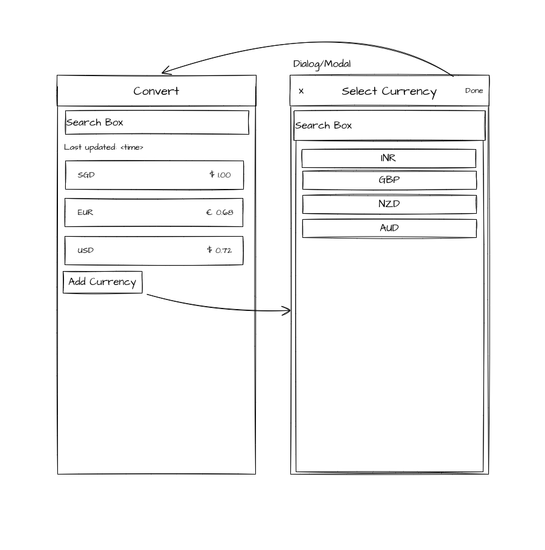

# Question 1

> We have a created a base structure for the project, so you dont have to start from scratch. But, you are more than welcome to make amendments as you build the app.

## Problem
Design a currency convertor app, which allows for converting multiple currencies at once. Similar to the [XE](https://www.xe.com/) currency convertor. 

### Mockup
Following is a rough mockup on the requirements.

> Please note that, we are not aiming on making the UI look pretty but making sure you are able to 
follow requirements.

### Requirements
1. Users should be able to search through the existing selected currencies
2. Users should be able to add new currencies via the dialog (as per the mockup)
3. The amount field is a text field, and should calculate the rate according to the value. Default amount can be `1`.
4. The selected currencies, should be saved locally on users phone.

### Additional Information
1. Please any of the publicly available API's to get latest data. You can use this, https://fixer.io/ or similar. For the time being, you can save the API key in the code, but we would like to know, how would handle this in a production app.
2. Most of these apis are rate limited, so please think about how you can effectively use them without hitting the limits. Please try to describe, what technique you followed, while building the app.
3. As mentioned before, we are not looking at building a really cool looking UI but, if you are able to make it look good, then bonus points for that!
4. Please stick to the wireframes and the requirements, so you don't spend a lot of time on building additional components.
5. We have setup a UI library [React Native Paper](https://callstack.github.io/react-native-paper/index.html), so you can use the UI libs from there.

## Objectives

The assessment objectives of this question are as follows:
- Following best practices
- Reusable code and components
- Well documented, self-explanatory
- Decoupling components wherever possible
- Follow clean architecture for FE components
